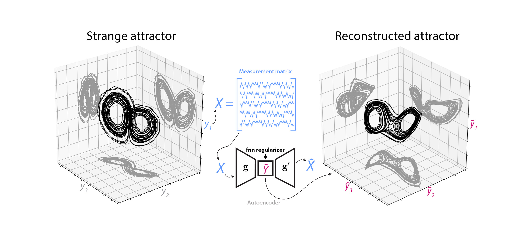

## fnn

Embed time series using neural networks that penalize spurious neighbors.



## Description

Given a one-dimensional or few-dimensional time series, this package uses the time history of the system to find additional hidden variables that describe the process in a higher-dimensional space. In this sense, the embedding attempts to invert a projection of the higher-dimensional dynamics induced by a measurement.

This package implements many standard time series embedding techniques originally developed for [embedding strange attractors of chaotic systems](http://www.scholarpedia.org/article/Attractor_reconstruction). These methods include average mutual information, Eigen-time-delay coordinates (ETD), time-lagged independent component analysis (tICA). The neural network models use a regularizer inspired by [the false-nearest-neighbors method of Kennel et al.](https://www.pks.mpg.de/~tisean/TISEAN_2.1/docs/chaospaper/node9.html).

The neural network and regularizer are further described in the following paper. If using this code for published work, please consider citing the paper.

> William Gilpin. "Deep reconstruction of strange attractors from time series" 2020. Advances in Neural Information Processing Systems (NeurIPS) 2020 [https://arxiv.org/abs/2002.05909](https://arxiv.org/abs/2002.05909)

# Installation

This library requires the following packages

+ Numpy
+ Scipy
+ Tensorflow 2.0 or greater
+ Scikit-learn
+ Matplotlib (demos only)
+ Jupyter Notebook (demos only)

To use this repository, directly download the source:

```bash
git clone https://github.com/williamgilpin/fnn
```

Test that everything is working:

```bash
python tests/test_models.py 
```

# Tutorials

Models follow the `scikit-learn` API

```python
from fnn.models import MLPEmbedding

model = MLPEmbedding(3, time_window=10)
time_series = np.loadtxt("datasets/lorenz.csv.gz", delimiter=",") # load 1D time series

embedding = model.fit_transform(time_series) # make 3D embedding
```

More detailed examples may be found in the various tutorial notebooks in the `demos` directory

+ [`demos.ipynb`](demos.ipynb) shows the step-by-step process of constructing embeddings of the Lorenz attractor,  experimental measurements of a double pendulum, a quasiperiodic torus, the Rössler attractor, and a high-dimensional chaotic ecosystem.
+ [`compare.ipynb`](compare.ipynb) trains an LSTM and MLP with the FNN regularizer, as well as comparison models with tICA, ETD, and Average Mutual Information embeddings.
+ [`exploratory.ipynb`](exploratory.ipynb) applies the embedding technique to several real-world time series datasets, such as electrocardiogram measurements, neural spiking, and measurements of eruptions of the Old Faithful geyser.


# Sources and related work

A great summary of the work in this repository, and the broader topic, has been written by Sigrid Keydana [on the RStudio blog](https://blogs.rstudio.com/ai/posts/2020-06-24-deep-attractors/). The post includes an R implementation of the fnn regularizer.

In order to provide a baseline embedding technique for comparison, the file `tica.py` has been extracted and modifed from the molecular dynamics suite [MSMBuilder](https://github.com/msmbuilder/msmbuilder). We include the modified file directly, in order to reduce dependencies. If using tICA in any work, please credit the original MSMBuilder authors and repository. 

# Datasets

The [`datasets`](exploratory.ipynb) folder contains abridged versions of several time series datasets used for testing and evaluating the code. We summarize these files, and provide their original sources, here:
+ `geyser_train_test.csv` corresponds to detrended temperature readings from the main runoff pool of the Old Faithful geyser in Yellowstone National Park, downloaded from the [GeyserTimes database](https://geysertimes.org/).  Temperature measurements start on April 13, 2015 and occur in one-minute increments. 
+ `electricity_train_test.csv` corresponds to average power consumption by 321 Portuguese households  between 2012 and 2014, in units of kilowatts consumed in fifteen minute increments. This dataset is from the [UCI machine learning database](http://archive.ics.uci.edu/ml/datasets/ElectricityLoadDiagrams20112014).
+ `pendulum_train.csv` and `pendulum_test.csv` correspond to two different double pendulum experiments, taken from a series of experiments by [Asseman et al.](https://developer.ibm.com/exchanges/data/all/double-pendulum-chaotic/). In Asseman et al.'s original study, pendula were filmed and segmented to produce (x, y) positions of centroids over time. Here, we have converted the dataset into the four canonical Hamiltonian coordinates (theta1, theta2, p1, p2).
+ `ecg_train.csv` and `ecg_test.csv` correspond to ECG measurements for two different patients, taken from the [PhysioNet QT database](https://physionet.org/content/qtdb/1.0.0/)
+ `mouse.csv` A time series of spiking rates for a neuron in a mouse thalamus. Raw spike data was obtained from [CRCNS](http://crcns.org/data-sets/thalamus/th-1/about-th-1) and processed with the authors' code in order to generate a spike rate time series.
+ `roaming_worm1.csv` and `dwelling_worm1.csv` are time series of the first five principal components of C. elegans body curvature during crawling, taken from [Ahamed et al 2019](https://www.biorxiv.org/content/10.1101/827535v1)
+ `gait_marker_trackers_patient1_speed1.csv` and `gait_force_patient1_speed1.csv` are marker positions and force recordings for a patient running on a treadmill, from [the GaitPhase database](https://www.mad.tf.fau.de/research/activitynet/gaitphase-database/)
+ `accelerometer_subject1.csv` contains smartphone accelerometer recordings of a walking individual, taken from [Vajdi et al 2019](https://arxiv.org/abs/1905.03109)

